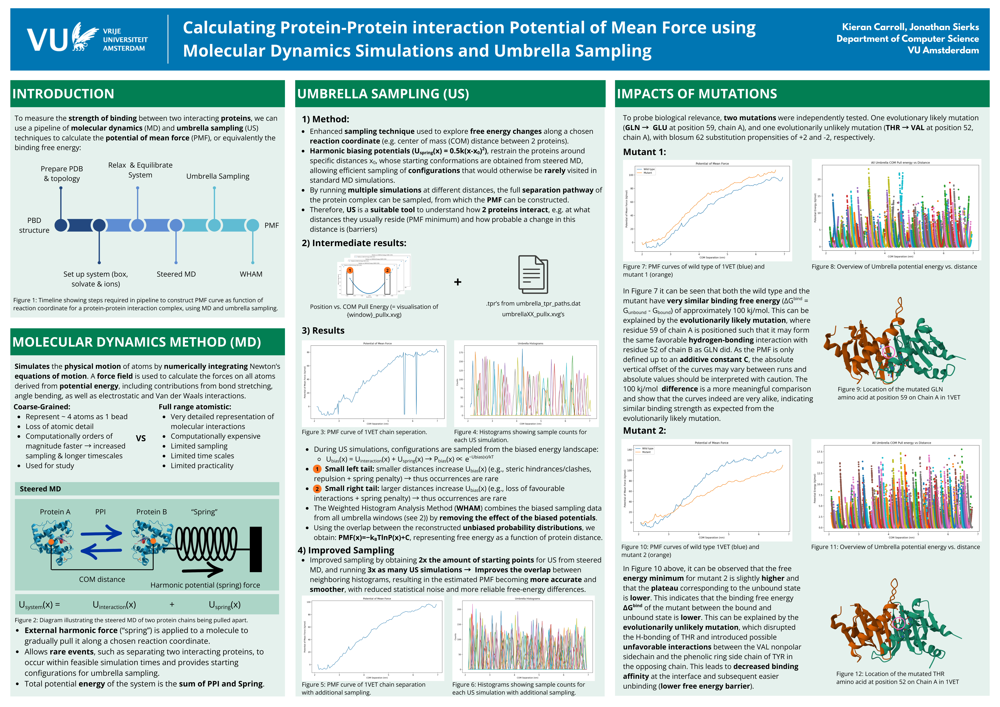

# 🧬 Protein Molecular Dynamics for Protein–Protein Interaction Analysis

This project studies a protein–protein complex using **molecular dynamics (MD)** and **umbrella sampling**. The main goal is to estimate the **potential of mean force (PMF)** along the protein separation coordinate and compare **wild type** behavior against two interface mutations.

## 🚀 Highlights

- End-to-end workflow for **protein–protein MD simulation and free-energy analysis**
- Use of **umbrella sampling** to probe dissociation states that are rarely visited in standard MD
- PMF reconstruction along a **center-of-mass (COM) distance** reaction coordinate
- Comparison of **wild type** and **two mutants** to assess mutation-induced changes in binding stability
- Separate simulation folders for different workflow stages and mutant systems
- Includes helper scripts for environment setup and PMF post-processing



## 🗂️ Method overview

The workflow starts with classical **molecular dynamics simulations** to equilibrate the protein complex and generate physically meaningful trajectories.  
To study dissociation, the interaction is projected onto a simple reaction coordinate: the **center-of-mass distance** between the two proteins.

Umbrella sampling is then used to sample a range of distances along this coordinate. Each sampling window applies a harmonic biasing potential,

$$
U_{\text{bias}}(\xi) = \frac{1}{2} k (\xi - \xi_0)^2
$$

where $\xi_0$ is the target distance of a given umbrella window and $k$ is the spring constant.

The biased simulations are finally combined to reconstruct the **potential of mean force (PMF)**, which provides a free-energy profile of binding and unbinding.  
In practice, this reconstruction is performed with **WHAM** (Weighted Histogram Analysis Method), which combines overlapping umbrella windows into a single consistent PMF curve.

## 📊 Main findings

- The workflow produced PMF profiles for the **wild type** system and both mutants.
- One mutation showed a PMF behavior **similar to wild type**, suggesting only a limited effect on binding.
- The other mutation showed a PMF profile **more consistent with weaker binding and easier unbinding**.

## 🧪 Mutational analysis

Two interface mutations were compared against the wild type system to assess their effect on binding stability.

- **GLN59 → GLU**: PMF profile broadly similar to wild type, suggesting only a minor effect on binding.
- **THR52 → VAL**: PMF profile more consistent with weaker binding and easier unbinding.


## ⚙️ How to run

This project was run in a **university bioinformatics server environment** rather than as a fully standalone local setup.  
To reproduce the workflow, you will need access to a Linux-based environment with **GROMACS** installed, along with the required simulation input files and sufficient compute resources.

### Requirements

- Linux environment
- **GROMACS**
- Bash shell
- Python for post-processing
- Access to the project input/output files for the different workflow stages

Depending on your system, you may also need to load a preconfigured module or source a local environment script before running GROMACS commands.

### Environment setup

If available, source the included shell setup script:

```bash
source gmx_env.sh
```
## Repository structure

```
part1/               # initial setup and early simulation steps
part2/               # intermediate workflow steps
part3/               # umbrella sampling / PMF-related analysis
part4/               # later-stage workflow outputs
part4_mutant1/       # mutant 1 simulation/analysis
part4_mutant2/       # mutant 2 simulation/analysis
combine_pmf.py       # helper script for PMF processing/combination
gmx_env.sh           # shell setup for the GROMACS environment